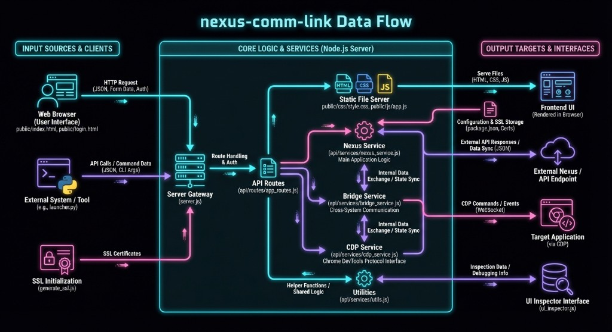

# Nexus Comm-Link

[](https://opensource.org/licenses/MIT)

**Nexus Comm-Link** is a lightweight server that provides a real-time mobile bridge for development sessions. It allows you to monitor and interact with your IDE from any mobile device via direct DOM mirroring and Chrome DevTools Protocol (CDP) integration.



---

## Core Features

- **Real-Time Monitoring**: 1:1 visual mirroring of your Antigravity development session.
- **Remote Interaction**: Send messages, stop generations, and change settings (Mode/Model) from your mobile device.
- **Chat History**: Browse and switch conversations from your phone; tap to load any recent chat on desktop.
- **Action Relay**: Tap Apply, Accept, or Reject buttons remotely with robust CDP matching.
- **Remote Undo**: One-tap Back/Undo from mobile.
- **Thought Expansion**: Peek into the AI's reasoning—tap to expand or collapse thought blocks from your phone.
- **Power Toggle**: Start or stop the connector server from mobile.
- **Global Access**: Optional secure tunneling via ngrok for remote connectivity over mobile data.
- **Scroll Synchronization**: Syncs viewport positions between mobile and desktop.
- **Zero-Dependency UI**: Sandboxed rendering ensures that mobile interactions do not disrupt the desktop session.
- **HTTPS Support**: Provides encrypted connections for secure remote access.

---

## Installation & Setup

### 1. Enable Desktop Debugging
Start your environment with the remote debugging port enabled.

**Command Line:**
```bash
antigravity . --remote-debugging-port=9000
```

**Context Menu (Linux/Windows):**
Run the installer script to add "Open with Antigravity (Debug)" to your file manager's right-click menu:
- Windows: `install_context_menu.bat`
- Linux: `./install_context_menu.sh`

### 2. Start the Connector
The server requires an active session to mirror. Ensure a chat is open on your desktop before starting the connector.

**Local Access:**
```bash
chmod +x start_nexus_connect.sh
./start_nexus_connect.sh
```

**Remote Access (Web Mode):**
Requires an [ngrok Authtoken](https://ngrok.com).
```bash
cp .env.example .env
# Edit .env with your NGROK_AUTHTOKEN and APP_PASSWORD
./start_nexus_connect_web.sh
```

---

## Security & Access Control

Nexus Comm-Link provides tiered access security:
- **LAN Access**: Trusted by default for devices on the same Wi-Fi network.
- **Remote Access**: Protected by passcode authentication and signed session cookies.
- **Encryption**: TLS 1.2/1.3 supported via auto-generated self-signed certificates.

See [SECURITY.md](SECURITY.md) for detailed configuration and browser trust instructions.

---

## Documentation

- [Code Documentation](CODE_DOCUMENTATION.md) - Architecture and API overview.
- [Security Policy](SECURITY.md) - Vulnerability reporting and security model.
- [Design Philosophy](DESIGN_PHILOSOPHY.md) - Project rationale and design decisions.
- [Task Tracker](TASKS.md) - Development roadmap.

---

## License

This project is licensed under the MIT License. See the [LICENSE](LICENSE) file for details.  
Copyright (c) 2026 **Nexus-Comm-Link**
