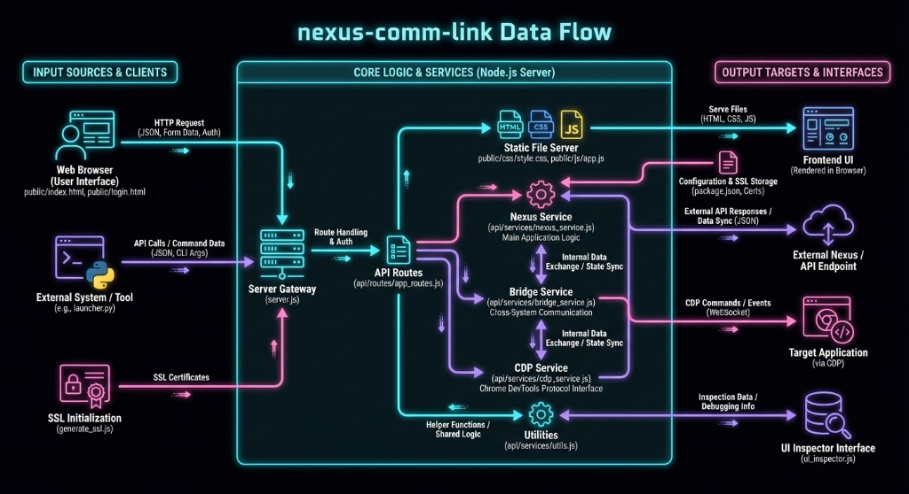

# Nexus Comm-Link

**Secure Remote Orchestration for Multimodal Development**

Nexus Comm-Link is a high-performance bridge that enables real-time, voice-first remote interaction with your development environment. It mirrors your IDE state to any mobile device, providing situational awareness and control without the latency of traditional screen sharing.



---

## Architecture Overview

### Semantic IDE Mirroring
A high-fidelity state extraction engine powered by the **Chrome DevTools Protocol (CDP)**. It provides semantic DOM snapshots and 1:1 visual mirroring, enabling direct interaction with internal UI components from a secondary device.

### Multimodal Audio Bridge
A low-latency audio pipeline optimized for native multimodal models. It features hardware-aware synchronization and sub-100ms chunk processing for fluid, natural voice interaction.

### Context Management
Maintains a rolling conversational history from the IDE state using intelligent delta-hashing. This ensures the bridge maintains precise situational memory without unnecessary bandwidth overhead.

### Remote Action Relay
A modular control interface that allows for remote execution of IDE commands (Apply, Accept, Reject, Undo). Commands are relayed via the CDP bridge to simulate native interactions in the primary workspace.

---

## Getting Started

### 1. Enable Debugging
Launch your environment with the remote debugging port enabled.

```bash
antigravity . --remote-debugging-port=9000
```

### 2. Launch the Connector
The server requires an active session to mirror. 

```bash
chmod +x start_nexus_connect.sh
./start_nexus_connect.sh
```

---

## Documentation
- [Design Philosophy](DESIGN_PHILOSOPHY.md) - Rationale and design decisions.
- [Security Model](SECURITY.md) - Authentication and connection security.

---

## License
Licensed under the **Polyform Non-Commercial 1.0.0 License**. See [LICENSE](LICENSE) for full details.
Copyright (c) 2026 **Nexus Command Lab**
